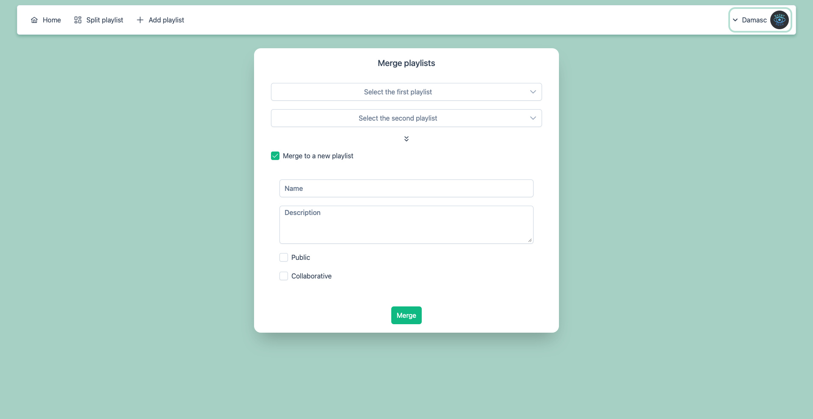

# Spotify Organizer

----

## Objective
Managing your Spotify playlists easily.

## Solution

A web app that connects to your Spotify account and gives you powerful playlist management tools. 
You can easily merge multiple playlists into one or split a playlist by artist — automatically grouping 
songs by the same artist into new playlists. It offers a simple and intuitive interface to organize 
your music library exactly the way you want.

## Images

